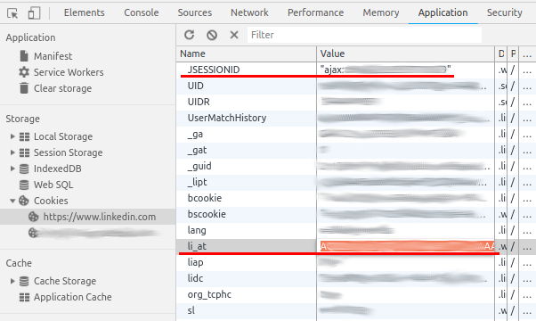

# linkedin-scraper

This tool allows you to scrape LinkedIn profiles based on search queries. You can use the end result for NLP/text analysis.

This repo is a heavily modified version of [dchrastil's ScrapedIn](https://github.com/dchrastil/ScrapedIn) with the addition of in-profile scraping.

### Prerequisites

You will need python 3+. 

First clone this repo, then navigate to the folder and install the requirements

```
git clone https://github.com/hakim-khan/linkedin-scraper.git
cd linkedin-scraper
pip install -r requirements.txt
```

### Configuring

There are 4 config settings you must change before the tool runs successfully.

In config.json, change the following values to match your LinkedIn sign-on info
```
"username": "user_email@example.com",
"password": "password",
```

Additionally, you will need to extract some cookie settings in order to login successfully

```
"li_at": "Aexampleexampleexamplee........",
"Csrf-Token": "ajax:1234567890123456789",
```

You can do this in chrome by logging in to LinkedIn -> right click page -> "Inspect" -> "Application" tab -> "Cookies".
 
 
 
 Then double click the relevant values marked in red. "JSESSIONID" goes into "Csrf-Token" and "li_at" into "li_at". 

### Running

Once you're set up and configured, you can run the tool via

```
python run.py -s "search query"
```

Where search query can be any job title such as "Data Scientist" etc.

The end result will be a CSV containing the following information

| Column name | Content |
| --- | --- |
| person_id | Identifier for profile |
| fs_profile | Main profile information |
| fs_position | All information for all job positions listed |
| fs_education | All information for all attained education  |
| fs_language | Any languages the person speaks |
| fs_skill | Any skills the person has provided |
| fs_project | Any projects the person has completed |
| fs_honor | Any activities and honors the person has |
| fs_publication | Any publications the person has published |
| fs_course | Courses the person has completed |

Enjoy!

### Disclaimer
This educational tool probably violates LinkedIns terms of service. Use at your own risk.